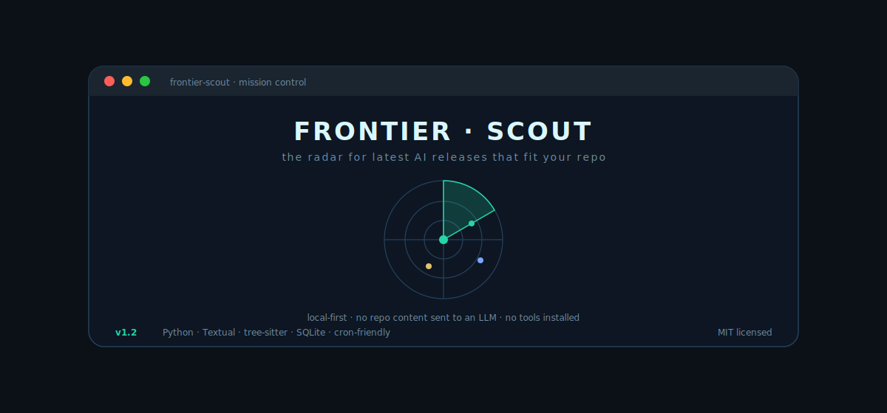

<!--
README structure follows the spirit of othneildrew/Best-README-Template
(MIT) adapted for Frontier Scout's brand and audience.
-->

<a id="readme-top"></a>

<div align="center">

<a href="https://github.com/ajaysurya1221/frontier-scout">
  
</a>

<h1>Frontier Scout</h1>

<p>
  <strong>Deep Scout — know about new AI tools, MCP servers, models, and risky dependency upgrades <em>before</em> everyone else. Personalised, local-first, try-before-trust.</strong>
</p>

<p>
  <a href="#-quickstart">Quickstart</a>
  &nbsp;·&nbsp;
  <a href="#-60-second-demo">Demo</a>
  &nbsp;·&nbsp;
  <a href="#-roadmap">Roadmap</a>
  &nbsp;·&nbsp;
  <a href="https://github.com/ajaysurya1221/frontier-scout/issues/new?template=bug.md">Bug report</a>
  &nbsp;·&nbsp;
  <a href="https://github.com/ajaysurya1221/frontier-scout/issues/new?template=feature_request.md">Feature request</a>
  &nbsp;·&nbsp;
  <a href="https://github.com/ajaysurya1221/frontier-scout/releases">Releases</a>
</p>

<p>
  <a href="https://github.com/ajaysurya1221/frontier-scout/releases"></a>
  
  
  <a href="https://github.com/ajaysurya1221/frontier-scout/actions"></a>
  <a href="https://github.com/ajaysurya1221/frontier-scout/commits/main"></a>
  
</p>

</div>

<details>
<summary>📑 Table of contents</summary>

- [Why Frontier Scout](#-why-frontier-scout)
- [Built with](#-built-with)
- [Quickstart](#-quickstart)
- [60-second demo](#-60-second-demo)
- [Usage — killer workflow](#-usage--killer-workflow)
- [Safety model](#-safety-model)
- [Cost](#-cost)
- [Roadmap](#-roadmap)
- [Contributing](#-contributing)
- [License](#-license)
- [Acknowledgments](#-acknowledgments)

</details>

---

## 🔭 Why Frontier Scout

**Deep Scout — know about new AI tools, MCP servers, models, and risky
dependency upgrades *before* everyone else.** Frontier Scout reads your repo
locally (filenames + AST imports, never source content) and turns the firehose
of public AI releases into a **personalised adoption radar** with
ADOPT / TRIAL / ASSESS / HOLD verdicts.

Three promises that anchor the product:

- **Try before trust.** Every adoption candidate gets a sandbox dry-run
  receipt, a permission map, and a guard check before it touches your real
  repo.
- **Fix vulnerabilities you didn't know existed.** Dependency intelligence
  cross-references your manifests against curated feeds — security,
  hardening, and breaking upgrades — and emits a trial recipe, not a
  lockfile rewrite.
- **Bound risky engineering changes.** Incident Change Scout turns an
  incident ticket into cited context, a bounded remediation plan, and a
  HITL approval interrupt before any write.

The TUI is the front door. Inside any repo:

```bash
frontier-scout
```

As of **v1.5.0** that lands you on **the Briefing** — a calm,
wizard-style scout that hands you one card at a time. A home menu
(*Scout my repo · Explore a tool · Settings · Quit*) leads into focused
flows; staged progress while it works (never a frozen "loading
forever"); then a card carousel where each finding shows *what* it is,
*why it fits your repo*, its concerns, risk, and the *next safe step*.
An always-present one-line **compass** at the bottom tells you exactly
what you can do right now. `←/→` flip cards, `Enter` runs the primary
action (Implement & test in a repo, Tell me more without one), `a` opens
more actions, `Esc` always goes back. It is flawless at any terminal
size — a cramped VS Code panel and a full-screen window are both
first-class.

Prefer the previous tabbed Mission Control TUI? It stays reachable for
one release via `--ui classic` (or `FRONTIER_SCOUT_UI=classic`). Run
`frontier-scout setup` from anywhere to configure your LLM backend or
schedule recurring scouts.

Every other CLI command (`evaluate`, `trial`, `guard`, `report`,
`packs`, `deps`, `incident`, `dossier`) still works for scripting and
CI; the TUI no longer tries to surface them all on one screen.

The posture is deliberately boring in the good way: CLI first, SQLite/local
files by default, static reports, no hosted telemetry, no hidden
auto-installs, and explicit approval before risky actions.

### Why not just use newsletters or GitHub Trending?

| Option | What it gives you | What is missing |
|---|---|---|
| Newsletters | Good awareness | Not repo-aware, not source-verifiable, rarely actionable. |
| GitHub Trending | Popularity signal | No risk/fit/adoption-cost judgment. |
| Manual research | Highest nuance | Slow, inconsistent, easy to skip when busy. |
| **Frontier Scout** | **Source-backed verdicts and lab next steps** | **Requires your API key for live scans.** |

---

## 🧰 Built with


---

## ⚡ Quickstart

Prerequisites: **Python 3.11+**.

Install from [PyPI](https://pypi.org/project/frontier-scout/) with pipx
(recommended) or pip:

```bash
pipx install frontier-scout
# or, no install:
uvx frontier-scout demo
# or, plain pip:
pip install frontier-scout
```

Configure once (LLM backend, automation vs ad-hoc):

```bash
frontier-scout setup
```

### Bring your own LLM — one is enough

Frontier Scout needs **exactly one** LLM backend, and it works with whichever
one you already have. The setup wizard detects what's available and picks the
first present, in this order:

| You have… | Set | Cost per scan |
|---|---|---:|
| An **Anthropic** API key | `ANTHROPIC_API_KEY` | ~$0.34 |
| An **OpenAI** API key | `OPENAI_API_KEY` | ~$0.05 |
| **Claude Code** installed | nothing — auto-detected | $0 marginal |
| **Codex CLI** installed | nothing — auto-detected | $0 marginal |

If you only have a Claude Code or Codex subscription and no API key, scouting
still works at **zero marginal cost** — Frontier Scout shells out to the CLI you
already pay for. Force a specific backend with `--provider anthropic|openai|claude-cli|codex-cli`
or the `FRONTIER_SCOUT_PROVIDER` env var. No backend at all? `frontier-scout
--demo` runs the whole pipeline offline against bundled fixtures.

Then, inside any repo, open Mission Control:

```bash
frontier-scout
```

Mission Control lands on the **Scout** tab — the radar that ranks the
latest AI releases that fit your repo. Tab keys `1`–`2` switch between
**Scout** and **Settings**. From the highlighted verdict row, every
core CLI capability is one keystroke: **Enter** for a dry-run trial,
**L** for a dry-run lab (press again within 3s to spend on a live
hermetic install), **e** for the Adoption-Firewall evaluation, **D**
for a dossier saved under `~/.frontier-scout/dossiers/`. Run it
outside a repo and the picker offers 🌐 **Universal scout (no repo)**
so you still get the latest releases on a golden plate, just not
tailored. The setup is remembered — once you've run the wizard,
`frontier-scout` from any directory drops you straight into Mission
Control; use `frontier-scout setup` or **Settings → Open setup
wizard** to reconfigure. The verdict detail panel surfaces explicit
**Concerns** — `burns tokens`, `abandoned`, `vendor lock-in`,
`security surface`, `marketing-only`, `unproven` — so you always see
why we'd push back on adoption. The import-evidence scanner reads
ASTs locally, provider availability shows up as cards, and nothing
reads secrets, logs into services, installs tools, or sends repo
content to an LLM. Limited terminals can use
`frontier-scout setup --plain`; automation can use
`frontier-scout setup --json`. The layout reflows for VS Code-style
80×24 panels.

### Develop locally

```bash
git clone https://github.com/ajaysurya1221/frontier-scout
cd frontier-scout
python3 -m venv .venv && source .venv/bin/activate
pip install -e ".[dev]"
frontier-scout --help
```

---

## ⏱ 60-second demo

No API key. No Slack workspace. No cloud setup.

```bash
make demo
open .scratch/incident-demo/answer.md
```

The incident demo writes:

- `.scratch/incident-demo/answer.md` — cited remediation answer.
- `.scratch/incident-demo/trace.jsonl` — local OpenTelemetry-shaped spans.
- `.scratch/incident-demo/audit.jsonl` — Cloudflare-style audit records.
- `.scratch/incident-demo/eval.json` — golden eval score.

Then run the AI tool radar demo:

```bash
frontier-scout demo
```

This spins up a local HTTP server, opens your browser automatically at
`http://localhost:<port>/`, and prints a guided next-steps panel in the
terminal. Press **Ctrl+C** to stop serving.

The terminal panel looks like:

```text
╭── ◉ FRONTIER · SCOUT  demo ready ───────────────────────────────────╮
│  Serving at  http://localhost:54321  ·  Ctrl+C to stop               │
│                                                                       │
│  ✓  briefing.html   adoption receipts                                 │
│  ✓  verdicts.json   raw verdict data                                  │
│  ✓  judge-trace.md  quality trace                                     │
│                                                                       │
│  Next steps:                                                          │
│    http://localhost:54321          ← browser opened · adoption cards  │
│    frontier-scout setup            ← Mission Control TUI              │
│    frontier-scout scan --dry-run   ← verdicts for this repo           │
│    ANTHROPIC_API_KEY=<key> ...     ← live scan                        │
╰───────────────────────────────────────────────────────────────────────╯
```

To write files without starting a server (CI or offline use):

```bash
frontier-scout demo --no-serve
```

The radar demo writes [`demo/briefing.html`](demo/briefing.html),
[`demo/briefing.md`](demo/briefing.md),
[`demo/verdicts.json`](demo/verdicts.json),
[`demo/cost-breakdown.md`](demo/cost-breakdown.md), and
[`demo/judge-trace.md`](demo/judge-trace.md).

---

## 🛰 Usage — killer workflow

Someone drops a GitHub repo, MCP server, plugin, model, or agent framework
in a newsletter or team chat. Frontier Scout turns that link into a local
adoption decision instead of a vibes-based "looks safe" answer:

```bash
frontier-scout init --repo .
frontier-scout evaluate <tool-url>
frontier-scout trial <tool-or-url> --dry-run
frontier-scout guard --repo .
frontier-scout report
```

- **`init`** writes a local stack profile under `~/.frontier-scout`
  (languages, package managers, container files, agent configs, and v0.4
  import evidence from a tree-sitter pass).
- **`evaluate`** records source-backed local evidence and a permission
  manifest for one URL — capability map included.
- **`trial --dry-run`** writes an adoption receipt without installing
  anything; full trials use the hermetic lab.
- **`guard`** checks the local evidence ledger for risky tools that still
  need a stored trial receipt; CI-friendly exit codes.
- **`report`** renders the static HTML executive radar.

Inspect living packs and repo-relevant dependency upgrades:

```bash
frontier-scout packs list
frontier-scout packs show mcp
frontier-scout profile --repo . --dependencies
frontier-scout deps scan --repo .
```

---

## 🔒 Safety model

Frontier Scout handles untrusted public content and can optionally execute
untrusted packages in the lab, so the safety rails are load-bearing:

- Source text is treated as untrusted data, not instructions.
- Tool names are checked against the source pool to reduce hallucinated verdicts.
- Source URLs must pass a domain allowlist.
- Incident and breach headlines are blocked from becoming tool recommendations.
- ADOPT requires enough readiness evidence or gets demoted.
- Adoption Firewall fails closed on unknown MCP/tool capability surfaces.
- `guard` never modifies the repo; it only reads local evidence and policy.
- Lab subprocesses receive a stripped environment, wall-clock timeout, size
  caps, and generated-script secret scanning.
- **The import-evidence scanner is deterministic, local, and offline.** It
  parses ASTs via `tree-sitter`, never sends source content to an LLM, and
  never reaches the network.

See [SECURITY.md](SECURITY.md) for the threat model.

---

## 💸 Cost

`frontier-scout --demo` is free — it never calls the network. A live weekly
scan stays cheap, and the exact bill depends on which provider you point it at.
The numbers below are **measured** from real scans of ~220 live items (the
`scan` pipeline: a fast score pass, a fast verdict pass, and an optional
Opus-class judge pass):

| Provider (fast / deep model) | Score + verdict | + judge | **Weekly scan** |
|---|---:|---:|---:|
| **Anthropic** (Sonnet / Opus) | ~$0.22 | +$0.12 | **~$0.34** |
| **OpenAI** (gpt-4o-mini / gpt-4o) | ~$0.01 | +$0.04 | **~$0.05** |
| **Claude CLI** (`claude-code-cli`) | $0 | $0 | **$0 marginal** |
| **Codex CLI** (`codex-cli`) | $0 | $0 | **$0 marginal** |

- **Anthropic** gives the highest-quality verdicts (it's what the RLAIF loop
  was tuned against); ~$0.34 with the judge on, ~$0.22 with it off.
- **OpenAI** is ~7× cheaper because `gpt-4o-mini` carries the bulk passes;
  quality is good, the judge does the heavy lifting.
- **Claude CLI / Codex CLI** have **zero marginal cost** — they run through a
  subscription you already pay for, so a scan adds nothing to your bill.

Set `JUDGE_ENABLED=false` to skip the judge pass for the cheapest run on any
provider. Every call is written to a local ledger (`costs.jsonl`); run
`frontier-scout receipts` to see exactly what you spent.

---

## 🗺 Roadmap

- [x] **v0.1** — CLI scaffold, local demo, SQLite store, public docs.
- [x] **v0.2** — Living Scout Packs, dependency intelligence, Adoption
  Firewall (`evaluate`/`trial`/`guard`/`policy`), Incident Change Scout.
- [x] **v0.3** — Mission Control terminal setup, provider detection,
  Scout Pack multi-select, plain/JSON outputs.
- [x] **v0.4.0** — Monorepo profile walker + tree-sitter import-evidence
  scanner (Python and JS/TS), repo-relative `manifest_path`,
  `--no-imports` fast path, `.understand-anything/` detection.
- [x] **v0.4.1** — Mission Control v2 redesign: branded splash,
  designer palette, focus borders, modal quit/help/repo-path, RichLog
  result, sticky status banner, README v2.
- [x] **v1.0.0** — Mission Control complete: nine tabs (Scout / Trials
  / Receipts / Guard / Reports / Packs / Deps / Incident / Settings),
  scout-first landing with a verdict `DataTable` and per-verdict
  actions, every CLI capability has a TUI surface, `--tab` / `--no-scout`
  flags, dismiss persistence.
- [x] **v1.1.0** — Global setup wizard (`frontier-scout setup`),
  automation mode with cron scheduling, notifications, diff view,
  Go/Rust/Ruby tree-sitter coverage, `frontier-scout doctor`,
  `clear-history` / `notifications` / `cron run` CLI siblings.
- [x] **v1.2.1** — Lab hermeticity (temp HOME + env scrub), repo-scoped
  policy + reports, cron credential strategy, dependency-trial honesty.
- [x] **v1.3.0** — Mission Control redesign: ▶ Scout now button, live
  staged progress, glossary overlay, responsive layout, `--progress` CLI.
- [x] **v1.4.0** — Universal LLM provider (Anthropic / OpenAI / Claude
  CLI / Codex CLI), AI-radar scope guardrail, RLAIF fit-grounding loop,
  Implement & Test, `frontier-scout --demo`, honest per-provider costs.
- [ ] **v1.5** — Streaming subprocess output in Trials, multi-repo
  workspace, launchd / Windows Task Scheduler integrations.

See [ROADMAP.md](ROADMAP.md) for the longer view.

---

## 🤝 Contributing

The fastest useful PRs improve the CLI/report path, validator coverage,
source quality, or lab isolation.

- Read [CONTRIBUTING.md](CONTRIBUTING.md).
- Browse [good first issues](https://github.com/ajaysurya1221/frontier-scout/labels/good%20first%20issue).
- Respect the [Code of Conduct](CODE_OF_CONDUCT.md).

Development loop:

```bash
make setup
make demo
make test
make eval
make audit
python -m compileall scripts outputs tests frontier_scout
PYTEST_DISABLE_PLUGIN_AUTOLOAD=1 python -m pytest -q
```

CI runs compile checks, non-live tests, and a tracked-file secret scan.

### Releasing a tagged version

1. Bump `project.version` in `pyproject.toml` and `frontier_scout/__init__.py`.
2. Append a matching `## X.Y.Z - YYYY-MM-DD` section to `CHANGELOG.md`.
3. Merge to `main`.
4. Push annotated tag `vX.Y.Z`.

Tag pushes trigger `.github/workflows/release.yml`, which builds
distributions, creates a GitHub Release from the matching changelog
section, and (via manual workflow_dispatch) publishes to PyPI via
trusted publishing.

---

## 📄 License

Distributed under the [MIT License](LICENSE).

---

## 🙏 Acknowledgments

- [Textual](https://textual.textualize.io/) — the framework that makes the
  Mission Control TUI possible.
- [tree-sitter-language-pack](https://github.com/Goldziher/tree-sitter-language-pack)
  — precompiled grammars for the v0.4 import-evidence scanner.
- [Pydantic](https://docs.pydantic.dev/) — typed models throughout.
- [othneildrew/Best-README-Template](https://github.com/othneildrew/Best-README-Template)
  — the structure this README borrows from.
- [Lum1104/Understand-Anything](https://github.com/Lum1104/Understand-Anything)
  — the tree-sitter half of its design pushed us to ship deterministic
  import evidence instead of substring heuristics.

<p align="right"><a href="#readme-top">↑ back to top</a></p>
