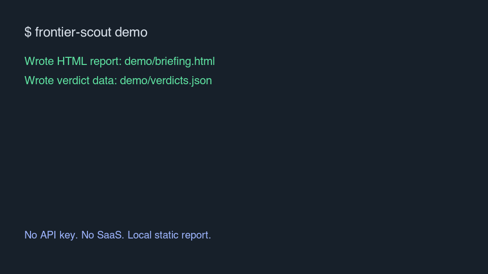
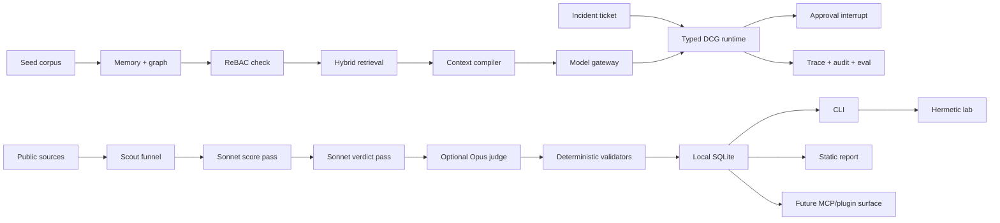

# Frontier Scout

> Policy-first, graph-aware intelligence for deciding which AI tools and engineering changes are safe to trust.




[Demo](#60-second-demo) · [What You Get](#what-you-get) · [Architecture](#architecture) · [Safety](#safety-model) · [Quickstart](#quickstart) · [Roadmap](ROADMAP.md) · [Security](SECURITY.md)

Frontier Scout now has two compatible layers:

- **Radar / Adoption Firewall:** local AI-tool scouting, sandbox trials, policy
  receipts, and static reports.
- **Engineering Scout platform:** graph-aware retrieval, typed context
  packets, bounded DCG execution, ReBAC authorization, HITL interrupts,
  traces, audit logs, and evals.

The first full platform slice is **Incident Change Scout**: paste an incident
ticket or engineering question, reconstruct the evidence graph, enforce
authorization, compile cited context, propose a bounded remediation plan, pause
before risky actions, and write trace/audit/eval artifacts.

Each recommendation is an **adoption receipt**: source evidence, verdict tier,
risk, stack fit, readiness, estimated adoption cost, and the next lab action.

The product surface is deliberately simple:

- **CLI first**: run scans, render reports, and test tools from your terminal.
- **Local by default**: SQLite under `~/.frontier-scout`, static HTML/Markdown reports, no hosted backend.
- **Agent-ready later**: Claude Code, Codex, Cursor, and MCP integrations consume the same local store.
- **Small-maintainer alpha**: v0.1 is public and usable, but intentionally conservative about scope.

## 60-second demo

No API key. No Slack workspace. No cloud setup.

```bash
git clone https://github.com/ajaysurya1221/frontier-scout
cd frontier-scout
python3 -m venv .venv && source .venv/bin/activate
pip install -e ".[dev]"
frontier-scout demo
open demo/briefing.html
```

## Engineering Scout demo

No API key is required.

```bash
pip install -e ".[dev]"
make demo
open .scratch/incident-demo/answer.md
```

The demo writes:

- `.scratch/incident-demo/answer.md` — cited remediation answer.
- `.scratch/incident-demo/trace.jsonl` — local OpenTelemetry-shaped spans.
- `.scratch/incident-demo/audit.jsonl` — Cloudflare-style audit records.
- `.scratch/incident-demo/eval.json` — golden eval score.

The demo writes:

- [`demo/briefing.html`](demo/briefing.html) — static executive radar.
- [`demo/briefing.md`](demo/briefing.md) — Markdown version for issues/docs.
- [`demo/verdicts.json`](demo/verdicts.json) — structured verdict payload.
- [`demo/cost-breakdown.md`](demo/cost-breakdown.md) — expected live-run spend shape.
- [`demo/judge-trace.md`](demo/judge-trace.md) — what the judge layer protects against.

## What you get

- **AI ecosystem scouting** across GitHub releases, trending repos, MCP/skills sources, RSS, HN, Hugging Face, and a small arXiv slice.
- **ADOPT / TRIAL / ASSESS / HOLD verdicts** with risk, stack fit, readiness, adoption cost, provenance, and next action.
- **Adoption Firewall** commands for try-before-trust evaluation: local evidence ledger, permission manifests, sandbox trial receipts, and CI-friendly guard checks.
- **Optional Opus judge pass** that vetoes patch-release noise, incident-as-tool mistakes, unsupported claims, and weak ADOPT calls.
- **Repo-aware stack detection** from common manifests and agent config files.
- **Polyglot lab runner** for Python, Node, and Hugging Face packages with hermetic subprocess execution.
- **Local history** in SQLite so future CLI/MCP/plugin surfaces can compare what changed over time.

## Why not just use newsletters or GitHub Trending?

| Option | What it gives you | What is missing |
|---|---|---|
| Newsletters | Good awareness | Not repo-aware, not source-verifiable, rarely actionable. |
| GitHub Trending | Popularity signal | No risk/fit/adoption-cost judgment. |
| Manual research | Highest nuance | Slow, inconsistent, easy to skip when busy. |
| Frontier Scout | Source-backed verdicts and lab next steps | Requires your API key for live scans. |

## Architecture



The current engine lives in [`scripts/`](scripts/). The installable CLI lives
in [`frontier_scout/`](frontier_scout/). `scripts/` remains importable so the
existing Scout and lab logic can be packaged without a risky rewrite.

## Quickstart

Install from a checkout:

```bash
python3 -m venv .venv
source .venv/bin/activate
pip install -e ".[dev]"
frontier-scout --help
```

Initialize local state and detect stack signals:

```bash
frontier-scout init --repo .
```

Run a free seeded scan:

```bash
frontier-scout scan --dry-run --repo .
frontier-scout report --input demo/verdicts.json --output demo/briefing.html
```

Run a live scan:

```bash
export ANTHROPIC_API_KEY=...
frontier-scout scan --repo .
frontier-scout report
```

Try-before-trust a single tool before granting it project permissions:

```bash
frontier-scout evaluate https://github.com/modelcontextprotocol/servers
frontier-scout trial browser-use/browser-use --url https://github.com/browser-use/browser-use --dry-run
frontier-scout guard --repo .
```

`evaluate` records source-backed local evidence and a permission manifest.
`trial --dry-run` writes an adoption receipt without installing anything.
`guard` checks the local evidence ledger for risky tools that still need a
stored trial receipt.

After the first PyPI publish, the expected package install paths are:

```bash
pipx install frontier-scout
uvx frontier-scout demo
```

Until then, the checkout install above is the supported path. An
`npx frontier-scout` wrapper is intentionally a later distribution layer, not
the core implementation.

## Safety model

Frontier Scout handles untrusted public content and can optionally execute
untrusted packages in the lab, so the safety rails are load-bearing:

- Source text is treated as untrusted data, not instructions.
- Tool names are checked against the source pool to reduce hallucinated verdicts.
- Source URLs must pass a domain allowlist.
- Incident and breach headlines are blocked from becoming tool recommendations.
- ADOPT requires enough readiness evidence or gets demoted.
- Adoption Firewall fails closed on unknown MCP/tool capability surfaces.
- `guard` never modifies the repo; it only reads local evidence and policy.
- Lab subprocesses receive a stripped environment, wall-clock timeout, size caps, and generated-script secret scanning.

See [SECURITY.md](SECURITY.md) for the threat model.

## Cost

The offline demo is free. A normal live weekly scan is designed to stay cheap:

| Component | Typical cost |
|---|---:|
| Sonnet score pass | ~$0.15 |
| Sonnet verdict pass | ~$0.04 |
| Optional Opus judge | ~$0.12 |
| **Weekly scan** | **~$0.30** |

Set `JUDGE_ENABLED=false` to skip the Opus judge when you want the cheapest
possible run.

## Development

```bash
make setup
make demo
make test
make eval
make audit
python -m compileall scripts outputs tests frontier_scout
PYTEST_DISABLE_PLUGIN_AUTOLOAD=1 python -m pytest -q
frontier-scout demo
frontier-scout scan --dry-run
```

CI runs compile checks, non-live tests, and a tracked-file secret scan.

## Release

For v0.1 patch releases:

1. Bump `project.version` in `pyproject.toml`.
2. Update the matching section in `CHANGELOG.md`.
3. Merge to `main`.
4. Push annotated tag `vX.Y.Z`.

Tag pushes trigger `.github/workflows/release.yml`, which builds distributions,
publishes to PyPI via trusted publishing, and creates a GitHub Release from
the matching changelog section.

## Roadmap

See [ROADMAP.md](ROADMAP.md). The short version:

- **v0.1** — local CLI, static reports, SQLite, demo, GitHub Actions, clean public docs.
- **v0.2** — Adoption Firewall v0: evaluate, trial receipts, permission manifests, guard, richer repo-aware stack detection.
- **v0.3** — MCP/plugin surfaces for Claude Code, Codex, Cursor, and optional output plugins.

## Contributing

Read [CONTRIBUTING.md](CONTRIBUTING.md). The fastest useful PRs improve the
CLI/report path, validator coverage, source quality, or lab isolation.
Please also read the [Code of Conduct](CODE_OF_CONDUCT.md).

## License

[MIT](LICENSE)
