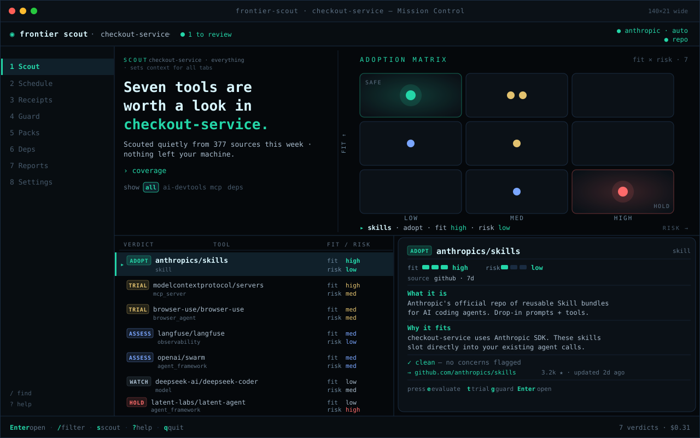

<!--
  Frontier Scout · README
  Hero + screenshot are self-contained, static SVGs (docs/assets/*.svg): system-mono,
  no external fonts / CSS / animation, so they render identically on GitHub light & dark.
  GitHub strips <style>/<script>/class/style= from README HTML, so ALL visual richness
  lives in baked SVG/PNG assets + plain markdown (tables, <details>, <kbd>, > [!TIP]).
  Structure inspired by othneildrew/Best-README-Template (MIT).
-->

<a id="readme-top"></a>

<div align="center">

<a href="https://github.com/ajaysurya1221/frontier-scout">
  
</a>

<p>
  <a href="https://github.com/ajaysurya1221/frontier-scout/releases"></a>
  &nbsp;
  
  &nbsp;
  
  &nbsp;
  
</p>

<sub>
  <a href="#-about">About</a> &nbsp;·&nbsp;
  <a href="#-quickstart">Quickstart</a> &nbsp;·&nbsp;
  <a href="#-bring-your-own-llm">Bring your own LLM</a> &nbsp;·&nbsp;
  <a href="#-60-second-demo">Demo</a> &nbsp;·&nbsp;
  <a href="#-cost">Cost</a> &nbsp;·&nbsp;
  <a href="#-roadmap">Roadmap</a>
</sub>

</div>

<br/>

> [!TIP]
> **377 releases scanned &#8594; 5 worth your time.** Newsletters tell you what's _popular_ and trending tells you what's _loud_ — neither knows your stack, and neither says whether a tool is safe to run. **Frontier Scout reads your repo locally, ranks every release against it, and refuses to say "ship it" without evidence.**

<details>
  <summary>&nbsp;<b>Table of contents</b></summary>
  <br/>

- [About](#-about) &#183; [How it works](#-how-it-works) &#183; [Three promises](#-three-promises)
- [Quickstart](#-quickstart) &#183; [Bring your own LLM](#-bring-your-own-llm) &#183; [60-second demo](#-60-second-demo)
- [The killer workflow](#-the-killer-workflow) &#183; [Safety model](#-safety-model) &#183; [Cost](#-cost)
- [Roadmap](#-roadmap) &#183; [Contributing](#-contributing) &#183; [License](#-license)

</details>

---

## 🛰&nbsp; About

**Frontier Scout is a local-first AI-adoption radar.** One pipeline, three jobs — **find what's new &#8594; figure out what's relevant to _your_ code &#8594; refuse to say "ship it" without evidence.** It runs as a dense, keyboard- and mouse-driven terminal app (Mission Control) or fully headless in CI, and works with whatever LLM you already pay for — or none at all.

<div align="center">
  <br/>
  
  <br/><br/>
  <sub>Mission Control — the <b>Adoption Matrix</b> (fit &#215; risk) cross-linked to the verdict list, with segmented gauges and a guard-gated detail panel.</sub>
  <br/>
</div>

<p align="right"><sub><a href="#readme-top">&#8593; back to top</a></sub></p>

---

## 🔭&nbsp; How it works

| | Stage | What it does |
| :-- | :-- | :-- |
| **01** | **WATCH** | Scouts GitHub Releases, the MCP registry, Hugging Face, and PyPI / npm — the frontier as it lands. |
| **02** | **MATCH** | A local tree-sitter pass maps releases to your repo's stack (Python, JS/TS, Go, Rust, Ruby) — **without ever reading your source**. |
| **03** | **DECIDE** | A source-backed **ADOPT / TRIAL / ASSESS / HOLD** verdict, plus the smallest safe trial to run next. |

Every finding lands on the **Adoption Matrix** (fit &#215; risk) and as a **verdict card** — a source-backed call, a fit / risk / readiness read, a permission map, and the safest next step. The detail panel surfaces explicit **concerns** (`burns tokens` &#183; `abandoned` &#183; `vendor lock-in` &#183; `security surface` &#183; `marketing-only` &#183; `unproven`), so you always see _why_ we'd push back. And **`guard` blocks adoption until a sandbox trial receipt exists.**

---

## 🎯&nbsp; Three promises

Awareness is table stakes. **Evidence is the product.**

| | |
| :-- | :-- |
| **◈&nbsp; Try before trust** | Every adoption candidate earns a sandbox dry-run receipt, a permission map, and a guard check **before it touches your real repo**. |
| **◆&nbsp; Fix vulns you didn't know existed** | Dependency intelligence cross-references your manifests against curated security, hardening, and breaking-change feeds — then emits a _trial recipe_, not a silent lockfile rewrite. |
| **◐&nbsp; Bound risky changes** | Incident Change Scout turns a ticket into cited context, a bounded remediation plan, and a **human approval interrupt** before any write. |

<p align="right"><sub><a href="#readme-top">&#8593; back to top</a></sub></p>

---

## ⚡&nbsp; Quickstart

> **Prerequisite** — Python 3.11+

```bash
# install (pipx recommended) — or run with no install at all
pipx install frontier-scout
uvx frontier-scout demo          # try it without installing

# configure your LLM backend once (auto-detects what you have)
frontier-scout setup

# open Mission Control inside any repo
cd ~/code/my-app && frontier-scout
```

Mission Control lands on the **Scout** tab — the radar that ranks the latest AI releases that fit your repo. From a highlighted verdict, every capability is one keystroke:

<div align="center">

<kbd>&nbsp;L&nbsp;</kbd> hermetic lab &nbsp;·&nbsp; <kbd>&nbsp;e&nbsp;</kbd> firewall eval &nbsp;·&nbsp; <kbd>&nbsp;i&nbsp;</kbd> implement &amp; test &nbsp;·&nbsp; <kbd>&nbsp;D&nbsp;</kbd> dossier &nbsp;·&nbsp; <kbd>&nbsp;o&nbsp;</kbd> open source &nbsp;·&nbsp; <kbd>&nbsp;P&nbsp;</kbd> palette

</div>

Tabs: **Scout &#183; Schedule &#183; Receipts &#183; Guard &#183; Packs &#183; Deps &#183; Reports &#183; Settings.** Everything reflows down to an 80&#215;24 VS Code panel, with unicode/ASCII and colour/mono fallbacks. Prefer a calmer, one-finding-at-a-time flow? `frontier-scout --ui briefing`.

<details>
  <summary>&nbsp;Develop locally</summary>
  <br/>

```bash
git clone https://github.com/ajaysurya1221/frontier-scout
cd frontier-scout
python3 -m venv .venv && source .venv/bin/activate
pip install -e ".[dev]"
frontier-scout --help
```

</details>

<p align="right"><sub><a href="#readme-top">&#8593; back to top</a></sub></p>

---

## 🔌&nbsp; Bring your own LLM

Frontier Scout needs **exactly one** backend and works with whichever you already have. The setup wizard detects what's present and picks the first available:

<div align="center">

| You have… | Set | Cost / scan |
| :-- | :-- | :-: |
| An **Anthropic** API key | `ANTHROPIC_API_KEY` | `~$0.34` |
| An **OpenAI** API key | `OPENAI_API_KEY` | `~$0.05` |
| **Claude Code** installed | _nothing — auto-detected_ | **`$0`** |
| **Codex CLI** installed | _nothing — auto-detected_ | **`$0`** |
| Any **OpenAI-compatible** gateway | `OPENAI_BASE_URL` | _your endpoint_ |

</div>

Already paying for a Claude Code or Codex subscription? Scouting runs at **zero marginal cost** — it shells out to the CLI you already pay for. New in **v1.7.0**: an `openai-compatible` provider for LiteLLM, vLLM, Ollama &amp; self-hosted gateways. Force a backend with `--provider anthropic | openai | claude-cli | codex-cli`.

> [!NOTE]
> **No backend at all?** `frontier-scout demo` runs the whole pipeline offline against bundled fixtures — no key, no network, no Slack, no cloud.

<p align="right"><sub><a href="#readme-top">&#8593; back to top</a></sub></p>

---

## ⏱&nbsp; 60-second demo

```console
$ frontier-scout demo

╭── ◉ FRONTIER · SCOUT — demo ready ──────────────────────────────╮
│                                                                  │
│   Serving at  http://localhost:54321   ·   Ctrl+C to stop        │
│                                                                  │
│   ✓  briefing.html    adoption receipts                          │
│   ✓  verdicts.json    raw verdict data                           │
│   ✓  judge-trace.md   quality trace                              │
│                                                                  │
│   Next ▸  frontier-scout setup           Mission Control TUI     │
│          frontier-scout scan --dry-run   verdicts for this repo  │
│                                                                  │
╰──────────────────────────────────────────────────────────────────╯
```

Writes [`briefing.html`](demo/briefing.html), [`briefing.md`](demo/briefing.md), [`verdicts.json`](demo/verdicts.json), [`cost-breakdown.md`](demo/cost-breakdown.md), and [`judge-trace.md`](demo/judge-trace.md) under `demo/`. Use `--no-serve` for CI / offline.

<p align="right"><sub><a href="#readme-top">&#8593; back to top</a></sub></p>

---

## 🛠&nbsp; The killer workflow

Someone drops a repo, MCP server, model, or agent framework in a newsletter or team chat. Turn that link into a local adoption **decision** instead of a vibes-based _"looks safe"_:

```bash
frontier-scout init --repo .            # local stack profile (+ tree-sitter import evidence)
frontier-scout evaluate <tool-url>      # source-backed evidence + permission map
frontier-scout trial <tool> --dry-run   # adoption receipt, installs nothing
frontier-scout guard --repo .           # CI gate: risky tools need a stored receipt
frontier-scout report                   # static HTML executive radar
```

Inspect living packs and repo-relevant dependency upgrades:

```bash
frontier-scout packs list               # candidate → watched → core → retired
frontier-scout deps scan --repo .       # repo-relevant security & breaking upgrades
frontier-scout dossier <tool>           # local adoption dossier with explicit unknowns
```

<p align="right"><sub><a href="#readme-top">&#8593; back to top</a></sub></p>

---

## 🔒&nbsp; Safety model

Frontier Scout handles untrusted public content and can optionally run untrusted packages in the lab — so the rails are load-bearing:

| Rail | What it guarantees |
| :-- | :-- |
| **Source text is data, not instructions** | Incident &amp; breach headlines can never become tool recommendations. |
| **No hallucinated tools** | Tool names are checked against the source pool; source URLs must pass a domain allowlist. |
| **ADOPT must earn it** | Not enough readiness evidence &#8594; demoted. The Adoption Firewall fails **closed** on unknown capability surfaces. |
| **The lab is hermetic** | Stripped environment, wall-clock timeout, size caps, and generated-script secret scanning. |
| **The scanner is offline** | Deterministic local tree-sitter AST parse — never sends source content to an LLM, never hits the network. |
| **`guard` never writes** | It only reads local evidence and policy; CI-friendly exit codes. |

See [SECURITY.md](SECURITY.md) for the full threat model.

<p align="right"><sub><a href="#readme-top">&#8593; back to top</a></sub></p>

---

## 💸&nbsp; Cost

`frontier-scout demo` is free — it never calls the network. The figures below model a live **weekly scan** (a recent run scanned **377** items, considered **350**, and shipped **5** verdicts for ~$0.31): a fast score pass, a fast verdict pass, and an optional Opus-class judge pass.

<div align="center">

| Provider <sub>(fast / deep)</sub> | Score + verdict | + judge | **Weekly scan** |
| :-- | :-: | :-: | :-: |
| **Anthropic** &nbsp;Sonnet / Opus | `~$0.22` | `+$0.12` | **`~$0.34`** |
| **OpenAI** &nbsp;4o-mini / 4o | `~$0.01` | `+$0.04` | **`~$0.05`** |
| **Claude CLI** &nbsp;subscription | `$0` | `$0` | **`$0`** |
| **Codex CLI** &nbsp;subscription | `$0` | `$0` | **`$0`** |

</div>

Set `JUDGE_ENABLED=false` to skip the judge for the cheapest run on any provider. Every call is written to a local `~/.frontier-scout/costs.jsonl` ledger — and the **Receipts** tab shows exactly what you spent.

<p align="right"><sub><a href="#readme-top">&#8593; back to top</a></sub></p>

---

## 🗺&nbsp; Roadmap

- [x] **`v0.2`** — Living Scout Packs, dependency intelligence, Adoption Firewall, Incident Change Scout
- [x] **`v0.4.0`** — Monorepo profile walker + tree-sitter import-evidence scanner (Python &amp; JS/TS)
- [x] **`v1.0.0`** — Mission Control: every CLI capability gets a TUI surface, scout-first landing
- [x] **`v1.1.0`** — Global setup wizard, cron automation, notifications, Go / Rust / Ruby coverage
- [x] **`v1.4.0`** — Universal LLM provider, RLAIF fit-grounding loop, honest per-provider costs
- [x] **`v1.5.0`** — Mission Control complete: 8-tab keyboard command center + command palette
- [x] **`v1.6.0`** — Mission Control v2: full mouse ↔ keyboard parity, permission map, repo switcher
- [x] **`v1.7.0`** — Single provider-selection ladder, two-tier scout/judge split, `openai-compatible` provider for gateway / self-hosted interop
- [ ] **Mission Control v5** _(in progress)_ — the **Adoption Matrix** (fit × risk dot-plot), segmented gauges everywhere, and the local architecture profile surfaced in Settings
- [ ] **Next** — streaming subprocess output in Trials, multi-repo workspace, launchd / Windows Task Scheduler

See [ROADMAP.md](ROADMAP.md) for the longer view.

<p align="right"><sub><a href="#readme-top">&#8593; back to top</a></sub></p>

---

## 🤝&nbsp; Contributing

The fastest useful PRs improve the CLI/report path, validator coverage, source quality, or lab isolation. Read [CONTRIBUTING.md](CONTRIBUTING.md), browse [good first issues](https://github.com/ajaysurya1221/frontier-scout/labels/good%20first%20issue), and respect the [Code of Conduct](CODE_OF_CONDUCT.md).

```bash
make setup && make demo && make test && make eval && make audit
```

CI runs compile checks, non-live tests, and a tracked-file secret scan.

## 📄&nbsp; License

Distributed under the [MIT License](LICENSE).

**Built with** — [Textual](https://textual.textualize.io/) (TUI) &#183; [tree-sitter-language-pack](https://github.com/Goldziher/tree-sitter-language-pack) (grammars) &#183; [Pydantic](https://docs.pydantic.dev/) (typed models) &#183; SQLite (local store). Structure inspired by [othneildrew/Best-README-Template](https://github.com/othneildrew/Best-README-Template); deterministic import evidence pushed forward by [Lum1104/Understand-Anything](https://github.com/Lum1104/Understand-Anything).

<div align="center">
  <br/>
  <sub><b>Frontier Scout</b> &#183; local-first &#183; no telemetry &#183; bring your own LLM</sub>
  <br/><br/>
  <a href="#readme-top">&#8593; back to top</a>
</div>
