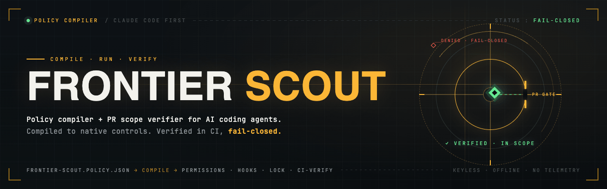

<div align="center">

<picture>
  <source media="(min-resolution: 2dppx)" srcset="docs/assets/frontier-scout-banner-2x.png">
  
</picture>

<p>
  <strong>Policy compiler + PR scope verifier for AI coding agents — Claude Code first.</strong><br>
  <sub>Compile a typed repo policy into native Claude Code controls. Verify PR scope in CI, fail-closed.</sub>
</p>

<p>
  
  
  
  
</p>

<p>
  <a href="#quickstart">Quickstart</a> ·
  <a href="#the-policy">Policy</a> ·
  <a href="#cli">CLI</a> ·
  <a href="#safety-model">Safety model</a> ·
  <a href="ROADMAP.md">Roadmap</a>
</p>

</div>

> **Research preview — technically coherent, not market-validated.** No PMF / adoption
> claim. Claude Code first (Codex/Cursor/Copilot are roadmap). Frontier Scout **emits**
> native config and **verifies** evidence — Claude Code and GitHub Actions do the
> enforcing. Its output is **control evidence, not a guarantee** that no unsafe action
> occurred.

## The problem

Teams want their engineers to use the coding agents they already prefer — without handing
them unconstrained repo, shell, network, and MCP access, and with **verifiable evidence in
every PR** of what the agent was allowed to do and what it actually did.

The agents already expose the controls (Claude Code has hooks, managed settings, MCP
allowlists, permission rules). What's missing is a way to **author one policy** and compile
it into those native controls, plus a way to **prove in CI** that a PR stayed inside it.
That's Frontier Scout.

## What it does

1. **Compile** a typed repo policy (`frontier-scout.policy.json`) into Claude Code's native
   controls: a `permissions` block, `PreToolUse`/`PostToolUse` hooks that decide
   allow/deny/ask and write **local action records**, a managed MCP allow/deny fragment, a
   `policy.lock.json` that binds those records to the exact policy, and a CI verify workflow.
2. **Run** Claude Code normally. The hook gates each real tool call and writes a redacted,
   local action record to `.frontier-scout/receipts/`.
3. **Verify** PR scope in CI. `verify-pr` checks the PR diff against the policy lock and the
   local action records — **fail-closed** — and annotates the PR.

No runtime, no sandbox, no MCP gateway, no policy language, no ledger, no signed-receipt
protocol: Frontier Scout compiles to and verifies the wheels that already exist. Keyless and
offline; the only runtime dependency is `pydantic`.

## Quickstart

```bash
pip install frontier-scout

cd your-repo
frontier-scout agent policy init          # conservative frontier-scout.policy.json from a scan
frontier-scout agent compile --target claude --repo . --out .
frontier-scout doctor                      # confirm policy/lock/hooks/workflow are in place
```

`compile` writes:

| Artifact | Purpose |
|---|---|
| `.claude/settings.json` | `permissions` (allow/deny/ask) + hook wiring |
| `.claude/hooks/pre_tool_use.py` · `post_tool_use.py` | decide allow/deny/ask, write receipts |
| `.claude/hooks/_fs_guard.py` | self-contained (stdlib-only) decision + receipt logic |
| `policy.lock.json` | sha256 binding receipts to this exact policy |
| `managed-settings.json` | admin/MDM MCP allow/deny fragment |
| `.github/workflows/frontier-scout-verify.yml` | the PR verifier check |

Then, in CI (the generated workflow runs this):

```bash
frontier-scout agent verify-pr --repo . --base "origin/main" \
  --receipts "frontier-scout-receipts/*.json"
```

It exits non-zero when a protected path changed without a receipt, the policy drifted from
the lock, a receipt's hash is stale, or an action ran despite a `deny`. Use `--advisory` to
warn instead of fail while a repo is being onboarded.

See [`examples/sample-repo/`](examples/sample-repo/) for an end-to-end walkthrough.

## The policy

`frontier-scout.policy.json` is a typed schema (not a new language), compiled to native
config — four dimensions plus approval gates:

```json
{
  "allowed_shell_commands": ["pytest", "git status"],
  "blocked_shell_commands": ["rm -rf", "git push --force"],
  "allowed_file_globs": ["src/**", "tests/**"],
  "protected_file_globs": ["**/migrations/**", ".github/workflows/**", "**/.env"],
  "mcp_server_allowlist": ["github"],
  "required_checks": ["pytest"],
  "approval_gates": ["network", "shell", "credential", "write", "protected-path"]
}
```

Decisions are **fail-closed**: anything not provably safe escalates to `ask`; off-allowlist
MCP servers and blocked commands hard-`deny`.

## CLI

| Command | What it does |
|---|---|
| `agent compile` | Compile the policy into Claude Code native controls + CI verifier |
| `agent verify-pr` | Fail-closed PR check: receipts + diff vs. the locked policy |
| `agent scan` | Static repo agent-risk scan (secret-likely files by name only) |
| `agent policy init \| explain` | Generate / read a conservative policy |
| `agent check "<task>"` | Static pre-check of a proposed task (executes nothing) |
| `agent receipts list \| show` | Inspect local audit receipts |
| `agent export agents-md \| pr-checklist` | Advisory policy snippets |
| `doctor` | Offline agent-readiness check |

## Safety model

- **Static + read-only.** The scan reads file *names*, never secret *contents*. The only
  subprocess is a read-only `git diff` in `verify-pr`.
- **Emit, don't enforce.** Frontier Scout writes native config; Claude Code's hook/permission
  system enforces locally and GitHub Actions enforces in CI.
- **Fail-closed.** A missing/malformed policy denies by default; every dangerous capability
  escalates to approval; a non-empty protected diff without receipts fails the PR.
- **Redacted.** Every persisted/emitted string is scrubbed of secret-shaped tokens.
- **Honest.** It is control evidence, not a guarantee. Local hooks are not a complete
  enforcement boundary — they are paired with the CI diff verifier on purpose. Correctness
  comes from deterministic compile output, receipts, and CI verification — Frontier Scout
  does not rely on optional Claude Code conveniences like hook input-rewriting or
  mid-session settings reload (even where current Claude Code supports them).

## What we don't build

Frontier Scout writes **local action records** for PR scope verification. It is **not** a
signed receipt protocol, signing daemon, MCP proxy, SDK, dashboard, or ledger. It deliberately
reuses wheels that already exist:

- **Claude Code** — runtime hooks, permissions, and managed settings (local enforcement).
- **GitHub Actions** — the PR check (CI enforcement).
- **MCP clients / gateways** — tool transport.
- **Existing receipt / provenance systems** (for example, Agent Receipts or GitHub artifact
  attestations) — for any future portable, signed evidence.

If portable signed receipts or provenance are needed later, Frontier Scout should integrate
with one of these rather than invent its own.

## Roadmap

P0 (shipped): the Claude compiler + local action records + GitHub verifier. P1: Codex adapter,
optional export/integration with existing receipt/provenance systems, scanner findings as
policy inputs. P2: passive Cursor/Copilot adapters, gateway-import mode. See
[ROADMAP.md](ROADMAP.md).

## Contributing

See [CONTRIBUTING.md](CONTRIBUTING.md) and [AGENTS.md](AGENTS.md). Tests:
`PYTEST_DISABLE_PLUGIN_AUTOLOAD=1 python -m pytest -q`. Lint/type: `make lint`, `make type`.

## License

MIT — see [LICENSE](LICENSE).
