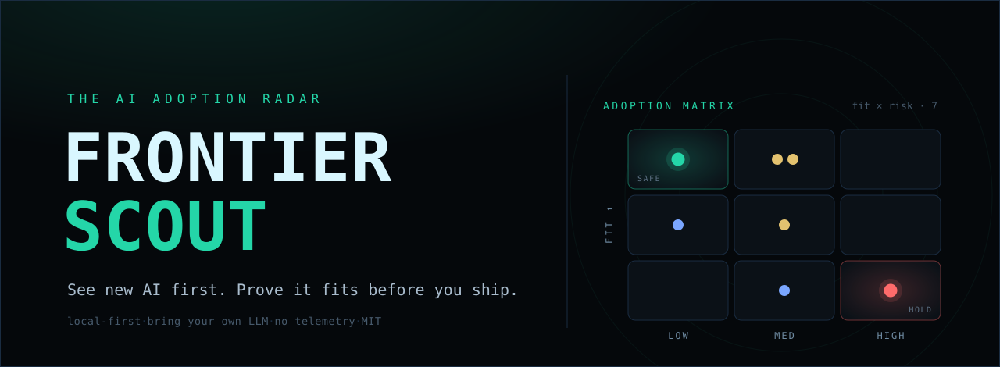
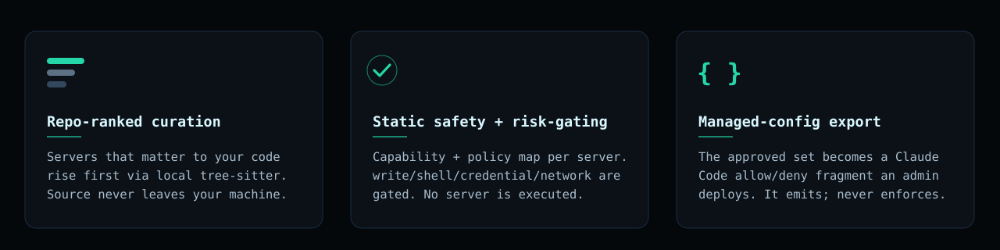
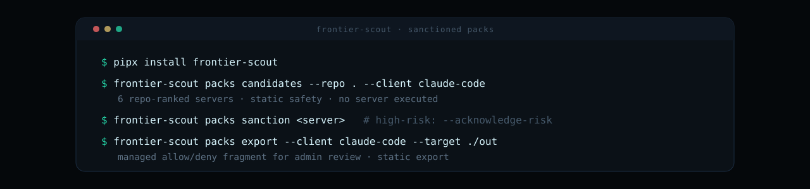

<!--
  Frontier Scout · README
  Visuals are self-contained, static SVGs (docs/assets/*.svg): system-mono, no external
  fonts / CSS / animation, so they render identically on GitHub light & dark, and stay
  legible at GitHub's ~800px content width. GitHub strips <style>/<script>/class/style=
  from README HTML, so richness lives in baked SVG assets + plain markdown (tables,
  <details>, <kbd>, > [!TIP]) + reference-style links (defined at the very bottom).
  Headers are plain text (no emoji) so heading anchors stay reliable.
  Structure & conventions inspired by othneildrew/Best-README-Template (MIT).
  Components: hero-banner.svg · divider.svg · what-you-get.svg · quickstart.svg.
-->
<a id="readme-top"></a>

<div align="center">

<a href="https://github.com/ajaysurya1221/frontier-scout">
  
</a>

<br />
<br />

[![Latest release][release-shield]][release-url] &nbsp; ![Python 3.11+][python-shield] &nbsp; ![Research preview][preview-shield] &nbsp; [![MIT License][license-shield]][license-url] &nbsp; ![No telemetry][telemetry-shield]

<br />

<a href="#quickstart"><b>Quickstart »</b></a>
&nbsp; &middot; &nbsp;
<a href="docs/examples/sanctioned-packs/">Gold-path example</a>
&nbsp; &middot; &nbsp;
<a href="docs/pivot/RESEARCH_PREVIEW_DECISION.md">Why a research preview</a>
&nbsp; &middot; &nbsp;
<a href="https://github.com/ajaysurya1221/frontier-scout/issues/new/choose">Send feedback</a>

</div>

> [!TIP]
> **Hundreds of MCP servers. Which ones are safe for _your_ team?** Registries and catalogs tell you what _exists_ — they don't rank by your repo, classify each server's capabilities, or hand you a config fragment to approve them. **Frontier Scout builds a repo-ranked, sanctioned MCP-server pack and exports it straight into Claude Code's managed allow-list.**

> [!NOTE]
> **Research preview — technically coherent, not market-validated.** This is an early, research-driven preview of repo-aware sanctioned MCP-server packs; it makes **no** human-validation / PMF / adoption claim. Today it is **Claude Code managed-config export first**; the safety read is **static analysis only** (no MCP server is executed in the sanctioned-pack flow); and it **emits config fragments — it does not enforce runtime policy**. **Copilot / Cursor / Docker support is roadmap**, not built. See the [research-preview decision note](docs/pivot/RESEARCH_PREVIEW_DECISION.md).

<details>
  <summary><b>Table of Contents</b></summary>
  <ol>
    <li><a href="#about">About</a></li>
    <li><a href="#how-it-works">How it works</a></li>
    <li><a href="#what-you-get">What you get</a></li>
    <li><a href="#quickstart">Quickstart</a></li>
    <li><a href="#safety-model">Safety model</a></li>
    <li><a href="#roadmap">Roadmap</a></li>
    <li><a href="#the-engine-underneath">The engine underneath</a></li>
    <li><a href="#built-with">Built with</a></li>
    <li><a href="#contributing">Contributing</a></li>
    <li><a href="#feedback">Feedback</a></li>
    <li><a href="#acknowledgments">Acknowledgments</a></li>
    <li><a href="#license">License</a></li>
  </ol>
</details>


## About

**Frontier Scout turns "can we use this MCP server?" into a one-step decision for your coding assistant.** It builds a **sanctioned pack** of approved MCP servers — **repo-ranked** so the ones that matter to _your_ code rise to the top — shows a **static safety map** (capability + policy) for each, and **exports the approved set into the Claude Code managed config your team already controls** (`allowedMcpServers` / `deniedMcpServers`). Keyless and offline by default.

```console
$ frontier-scout packs candidates --repo . --client claude-code
Repo-ranked mcp servers for claude-code (6):
- io.modelcontextprotocol/filesystem  fit=high risk=medium stdio  [needs review — static only]
- io.modelcontextprotocol/time        fit=high risk=medium stdio
- dev.sentry/sentry                   fit=high risk=medium http   [needs review — static only]
Static analysis only; no MCP server was executed.

$ frontier-scout packs export --client claude-code --target ./out
  managed: ./out/managed-settings.json   # allowedMcpServers / deniedMcpServers — an admin deploys it
  project: ./out/.mcp.json
Generated Claude Code managed-config fragment for admin review; this is a static export, not runtime enforcement.
```

> The product is the **sanctioned pack** → a Claude Code managed-config fragment an admin deploys — not the radar underneath. See the **[gold-path example](docs/examples/sanctioned-packs/)**, generated by the real CLI.

<p align="right">(<a href="#readme-top">back to top</a>)</p>

## How it works

| | Stage | What it does |
| :-- | :-- | :-- |
| **01** | **RANK** | Enumerate MCP servers (the curated offline pack, or the live MCP registry with `--discover`) and rank them against _your_ repo's stack with a local tree-sitter pass — **without ever reading your source**. |
| **02** | **CHECK** | A **static safety map** per server — capability classification (read / write / network / shell / credential) plus a policy verdict. **No server is started or executed.** |
| **03** | **SANCTION &#8594; EXPORT** | Approve servers (high-risk ones are gated behind an explicit acknowledgement), then export the approved set into Claude Code's **managed `allowedMcpServers` / `deniedMcpServers`** + a project `.mcp.json`. |

The local-first adoption **radar** that powers the ranking (`frontier-scout demo`, the Mission Control TUI, `evaluate` / `guard`) is the ranking + safety **engine underneath**, not the headline — see [The engine underneath](#the-engine-underneath).

<p align="right">(<a href="#readme-top">back to top</a>)</p>

## What you get

Discovery is table stakes. **A sanctioned, repo-relevant, exportable set is the product.**



<p align="right">(<a href="#readme-top">back to top</a>)</p>


## Quickstart

> **Prerequisite** — Python 3.11+. Keyless and offline by default.



```bash
pipx install frontier-scout                                       # or run with: uvx frontier-scout ...

frontier-scout packs candidates --repo . --client claude-code     # repo-ranked MCP servers + static safety
frontier-scout packs sanction <server> --repo .                   # approve (high-risk needs --acknowledge-risk)
frontier-scout packs export --client claude-code --target ./out   # managed allowedMcpServers + project .mcp.json
```

Full walkthrough: [docs/sanctioned-packs-quickstart.md](docs/sanctioned-packs-quickstart.md) &nbsp;·&nbsp; gold-path artifacts: [docs/examples/sanctioned-packs/](docs/examples/sanctioned-packs/).

<details>
  <summary>&nbsp;<b>Develop locally</b></summary>
  <br/>

```bash
git clone https://github.com/ajaysurya1221/frontier-scout
cd frontier-scout
python3 -m venv .venv && source .venv/bin/activate
pip install -e ".[dev]"
frontier-scout --help
```

</details>

<p align="right">(<a href="#readme-top">back to top</a>)</p>

## Safety model

Frontier Scout handles untrusted public content, and the engine can optionally run untrusted packages in a hermetic lab — so the rails are load-bearing. **The sanctioned-pack flow itself is static: it reads, ranks, and exports; it never executes an MCP server.**

| Rail | What it guarantees |
| :-- | :-- |
| **The pack scanner is offline** | Deterministic local tree-sitter AST parse — never sends source content to an LLM, never hits the network, never runs a server. |
| **Source text is data, not instructions** | Fetched release/incident text can never become a tool recommendation. |
| **No hallucinated tools** | Tool names are checked against the source pool; source URLs must pass a domain allowlist. |
| **`guard` never writes** | It only reads local evidence and policy; CI-friendly exit codes, non-blocking by default. |
| **The engine's lab is hermetic** | Where the radar _does_ run a package: stripped environment, wall-clock timeout, size caps, generated-script secret scanning, fails **closed** on unknown capability surfaces. |

See [SECURITY.md](SECURITY.md) for the full threat model.

<p align="right">(<a href="#readme-top">back to top</a>)</p>


## Roadmap

**Current direction — research preview:** repo-aware **sanctioned MCP-server packs** for Claude Code (`packs candidates / sanction / export`) — repo-ranked servers, a static safety map, risk-gated sanctioning, and an admin-deployable Claude managed-config fragment. **Validation-gated next** (only on real, workflow-shaped pull): a behavioral MCP probe and Copilot / GitHub allow-list exporters.

<details>
<summary><b>Shipped — the radar engine underneath (history)</b></summary>

- [x] **`v0.2`** — Living Scout Packs, dependency intelligence, Adoption Firewall, Incident Change Scout
- [x] **`v0.4.0`** — Monorepo profile walker + tree-sitter import-evidence scanner (Python &amp; JS/TS)
- [x] **`v1.0.0`** — Mission Control: every CLI capability gets a TUI surface, scout-first landing
- [x] **`v1.1.0`** — Global setup wizard, cron automation, notifications, Go / Rust / Ruby coverage
- [x] **`v1.4.0`** — Universal LLM provider, RLAIF fit-grounding loop, honest per-provider costs
- [x] **`v1.5.0`** — Mission Control: 8-tab keyboard command center + command palette
- [x] **`v1.6.0`** — Mission Control v2: full mouse ↔ keyboard parity, permission map, repo switcher
- [x] **`v1.7.0`** — Single provider-selection ladder, two-tier scout/judge split, `openai-compatible` provider
- [x] **`v1.8.x`** — Mission Control v5/v6 (Adoption Matrix, segmented gauges, architecture profile)

</details>

See [`docs/pivot/`](docs/pivot/) for the pivot record and the [open issues](https://github.com/ajaysurya1221/frontier-scout/issues) for what's being weighed next.

<p align="right">(<a href="#readme-top">back to top</a>)</p>

## The engine underneath

The pack is powered by a local-first **adoption radar** — the ranking + safety engine that scores tools against your repo and runs fully offline. It's kept as a legacy surface, not the headline. It works with whatever LLM you already pay for, or none at all.

<details>
<summary>&nbsp;<b>Bring your own LLM — zero marginal cost with a CLI you already pay for</b></summary>
<br/>

Frontier Scout needs **exactly one** backend and works with whichever you already have. The setup wizard detects what's present and picks the first available:

| You have… | Set | Cost / scan |
| :-- | :-- | :-: |
| An **Anthropic** API key | `ANTHROPIC_API_KEY` | `~$0.34` |
| An **OpenAI** API key | `OPENAI_API_KEY` | `~$0.05` |
| **Claude Code** installed | _nothing — auto-detected_ | **`$0`** |
| **Codex CLI** installed | _nothing — auto-detected_ | **`$0`** |
| Any **OpenAI-compatible** gateway | `OPENAI_BASE_URL` | _your endpoint_ |

Already paying for a Claude Code or Codex subscription? Scouting runs at **zero marginal cost** — it shells out to the CLI you already pay for. Force a backend with `--provider anthropic | openai | claude-cli | codex-cli`. Cost figures model a live weekly scan (a recent run scanned **377** items and shipped **5** verdicts for ~$0.31); set `JUDGE_ENABLED=false` to skip the deep judge pass. `frontier-scout demo` is always free — it never calls the network.

</details>

<details>
<summary>&nbsp;<b>Radar engine commands &amp; offline demo</b></summary>
<br/>

```bash
frontier-scout                          # the Mission Control TUI (the dense radar surface)
frontier-scout demo                     # render the whole pipeline offline — no key, no network
frontier-scout evaluate <tool-url>      # source-backed evidence + permission map for one tool
frontier-scout guard --repo . --notify  # non-blocking policy-drift / unsanctioned-tool notice
frontier-scout deps scan --repo .       # repo-relevant security & breaking dependency upgrades
```

`frontier-scout demo` writes `briefing.html`, `verdicts.json`, and a `judge-trace.md` under `demo/` and serves them locally; use `--no-serve` for CI / offline.

</details>

<p align="right">(<a href="#readme-top">back to top</a>)</p>


## Built with

![Python][built-python] &nbsp; ![Textual][built-textual] &nbsp; ![tree-sitter][built-treesitter] &nbsp; ![Pydantic][built-pydantic] &nbsp; ![SQLite][built-sqlite]

Local-first by design — a deterministic tree-sitter scanner, typed Pydantic models, a SQLite store, and a Textual TUI. No hosted service, no accounts, no telemetry.

<p align="right">(<a href="#readme-top">back to top</a>)</p>

## Contributing

The fastest useful PRs improve the CLI / export path, validator coverage, source quality, or lab isolation. Read [CONTRIBUTING.md](CONTRIBUTING.md), browse [good first issues](https://github.com/ajaysurya1221/frontier-scout/labels/good%20first%20issue), and respect the [Code of Conduct](CODE_OF_CONDUCT.md).

```bash
make setup && make demo && make test && make eval && make audit
```

CI runs compile checks, non-live tests, and a tracked-file secret scan.

<a href="https://github.com/ajaysurya1221/frontier-scout/graphs/contributors">
  
</a>

<p align="right">(<a href="#readme-top">back to top</a>)</p>

## Feedback

This is a **research preview**, so the most useful thing you can do is tell me where it breaks. Open a [sanctioned-pack feedback or client/export request](https://github.com/ajaysurya1221/frontier-scout/issues/new/choose) issue — it's **weak signal** that informs prioritization, **not** a validation gate. What earns a build is real, workflow-shaped pull: someone routing the Claude export through a real process, or two people independently asking for the same export target.

<p align="right">(<a href="#readme-top">back to top</a>)</p>

## Acknowledgments

- [othneildrew/Best-README-Template](https://github.com/othneildrew/Best-README-Template) — README structure & conventions
- [Textual](https://textual.textualize.io/) — the terminal UI framework
- [tree-sitter-language-pack](https://github.com/Goldziher/tree-sitter-language-pack) — the grammars behind the offline import scanner
- [Pydantic](https://docs.pydantic.dev/) — typed models throughout
- [Model Context Protocol](https://modelcontextprotocol.io/) — the MCP registry & server ecosystem this ranks
- [Lum1104/Understand-Anything](https://github.com/Lum1104/Understand-Anything) — pushed the deterministic import-evidence idea forward

<p align="right">(<a href="#readme-top">back to top</a>)</p>

## License

Distributed under the [MIT License](LICENSE).

<div align="center">
  <br/>
  <sub><b>Frontier Scout</b> &#183; research preview &#183; local-first &#183; static analysis &#183; no telemetry</sub>
</div>

<!-- MARKDOWN LINKS & IMAGES (reference-style) -->
[release-shield]: https://img.shields.io/github/v/release/ajaysurya1221/frontier-scout?include_prereleases&color=24d6a8&labelColor=05080b&label=release&style=for-the-badge
[release-url]: https://github.com/ajaysurya1221/frontier-scout/releases
[python-shield]: https://img.shields.io/badge/python-3.11+-7aa6ff?style=for-the-badge&labelColor=05080b&logo=python&logoColor=white
[preview-shield]: https://img.shields.io/badge/status-research%20preview-24d6a8?style=for-the-badge&labelColor=05080b
[license-shield]: https://img.shields.io/badge/license-MIT-a9bccd?style=for-the-badge&labelColor=05080b
[license-url]: https://github.com/ajaysurya1221/frontier-scout/blob/main/LICENSE
[telemetry-shield]: https://img.shields.io/badge/telemetry-none-e3c26f?style=for-the-badge&labelColor=05080b
[built-python]: https://img.shields.io/badge/Python-3.11+-7aa6ff?style=flat-square&labelColor=05080b&logo=python&logoColor=white
[built-textual]: https://img.shields.io/badge/Textual-TUI-24d6a8?style=flat-square&labelColor=05080b
[built-treesitter]: https://img.shields.io/badge/tree--sitter-offline%20AST-7aa6ff?style=flat-square&labelColor=05080b
[built-pydantic]: https://img.shields.io/badge/Pydantic-typed%20models-a9bccd?style=flat-square&labelColor=05080b&logo=pydantic&logoColor=white
[built-sqlite]: https://img.shields.io/badge/SQLite-local%20store-e3c26f?style=flat-square&labelColor=05080b&logo=sqlite&logoColor=white
