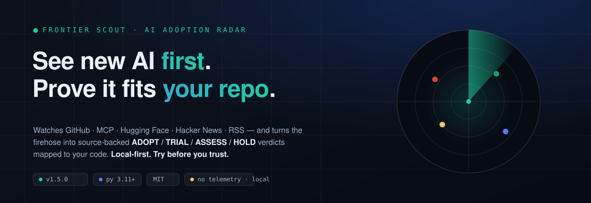

<!--
  Frontier Scout — README
  Hero banner: docs/assets/frontier-scout-radar.svg  (animated; renders on GitHub light + dark)
  Structure inspired by othneildrew/Best-README-Template (MIT).
-->

<a id="readme-top"></a>

<div align="center">

<a href="https://github.com/ajaysurya1221/frontier-scout">
  
</a>

<h3>See new AI <em>first</em>. Prove it fits <em>your</em> repo before you ship.</h3>

<p>
  Frontier Scout watches the whole AI ecosystem — <b>GitHub · MCP registries · Hugging Face · Hacker News · RSS</b> —
  cross-checks your <b>PyPI &amp; npm dependencies</b>, and turns the firehose into <b>source-backed ADOPT / TRIAL / ASSESS / HOLD verdicts</b> mapped to your actual code.
  <br/>Local-first. Bring your own LLM. Try before you trust.
</p>

<p>
  <a href="#-quickstart"><b>Quickstart</b></a> &nbsp;·&nbsp;
  <a href="#-how-it-works">How it works</a> &nbsp;·&nbsp;
  <a href="#-60-second-demo">Demo</a> &nbsp;·&nbsp;
  <a href="#-cost">Cost</a> &nbsp;·&nbsp;
  <a href="#-roadmap">Roadmap</a> &nbsp;·&nbsp;
  <a href="https://github.com/ajaysurya1221/frontier-scout/releases">Releases</a>
</p>

<p>
  <a href="https://github.com/ajaysurya1221/frontier-scout/releases"></a>
  
  
  <a href="https://github.com/ajaysurya1221/frontier-scout/actions"></a>
  
</p>

</div>

<br/>

> **377 releases scanned → 5 worth your time.** Newsletters tell you what's *popular*. Trending tells you what's *loud*. Neither knows your stack — and neither tells you whether a tool is safe to run. Frontier Scout reads your repo locally, ranks releases against it, and refuses to say "ship it" without evidence.

<details>
<summary>📑 <b>Table of contents</b></summary>

- [How it works](#-how-it-works)
- [Three promises](#-three-promises)
- [Quickstart](#-quickstart)
- [Bring your own LLM](#-bring-your-own-llm)
- [60-second demo](#-60-second-demo)
- [The killer workflow](#-the-killer-workflow)
- [Safety model](#-safety-model)
- [Cost](#-cost)
- [Roadmap](#-roadmap)
- [Contributing](#-contributing)
- [License &amp; acknowledgments](#-license)

</details>

---

## 🛰 How it works

One pipeline, three jobs: **find what's new → figure out what's relevant to _your_ code → refuse to say "ship it" without evidence.**

<table>
<tr>
<td width="33%" valign="top">

### `01` · WATCH
**Scout the whole web**

A candidate can enter from any source family — and only repeated, *independent* evidence promotes it.

`GitHub Trending` · `GitHub Releases` · `MCP registry` · `Hugging Face` · `HN · RSS · arXiv`

`candidate → watched → core → retired`

</td>
<td width="33%" valign="top">

### `02` · MATCH
**Map it to your repo**

A local tree-sitter pass reads filenames and AST imports — **never your source** — to learn your real stack.

`Python 3.12` · `Docker` · `AGENTS.md` · `MCP config` · `langchain-core==1.3.5`

Output: fit · risk · readiness.

</td>
<td width="33%" valign="top">

### `03` · DECIDE
**Verdict + safe next step**

Source-backed **ADOPT / TRIAL / ASSESS / HOLD**, a permission map, and the smallest safe trial to run next.

`capability surface` · `explicit concerns` · `dry-run receipt` · `CI guardrail`

</td>
</tr>
</table>

A verdict looks like this — note that **`guard` blocks adoption until a trial receipt exists**:

```text
  TRIAL  · modelcontextprotocol/servers            safe to test, not to ship
  ─────────────────────────────────────────────────────────────────────────
  what it is        MCP server          what it wants    read  ok   files ro
  fits your code    yes · high · 0.86                    net   ⚠    write ⚠
  risk level        medium · 0.42                        shell ✗    keys  ✗
  eval check        passed · 1.00/1.00   ⚠ guard         blocked until receipt
```

The verdict detail panel surfaces explicit **concerns** — `burns tokens`, `abandoned`, `vendor lock-in`, `security surface`, `marketing-only`, `unproven` — so you always see *why* we'd push back.

---

## 🎯 Three promises

| | |
|---|---|
| **◈ Try before trust** | Every adoption candidate gets a sandbox dry-run receipt, a permission map, and a guard check before it touches your real repo. |
| **◆ Fix vulns you didn't know existed** | Dependency intelligence cross-references your manifests against curated feeds (security, hardening, breaking) and emits a *trial recipe* — not a silent lockfile rewrite. |
| **◐ Bound risky changes** | Incident Change Scout turns a ticket into cited context, a bounded remediation plan, and a human approval interrupt before any write. |

---

## ⚡ Quickstart

> Prerequisite: **Python 3.11+**

```bash
# install (pipx recommended) — or run with no install at all
pipx install frontier-scout
uvx frontier-scout demo        # try it without installing

# configure your LLM backend once (auto-detects what you have)
frontier-scout setup

# open Mission Control inside any repo
cd ~/code/my-app && frontier-scout
```

Mission Control lands on the **Scout** tab — the radar that ranks the latest AI releases that fit your repo. From a highlighted verdict row, every capability is one keystroke:

<kbd>L</kbd> hermetic lab &nbsp;·&nbsp; <kbd>e</kbd> Adoption-Firewall eval &nbsp;·&nbsp; <kbd>i</kbd> implement &amp; test &nbsp;·&nbsp; <kbd>D</kbd> dossier &nbsp;·&nbsp; <kbd>o</kbd> open source &nbsp;·&nbsp; <kbd>p</kbd> command palette

Tabs: **Scout · Schedule · Receipts · Guard · Packs · Deps · Reports · Settings**. Everything reflows down to an 80×24 VS Code panel, with unicode/ASCII and colour/mono fallbacks. Prefer a calmer, one-finding-at-a-time flow? `frontier-scout --ui briefing`.

<details>
<summary>Develop locally</summary>

```bash
git clone https://github.com/ajaysurya1221/frontier-scout
cd frontier-scout
python3 -m venv .venv && source .venv/bin/activate
pip install -e ".[dev]"
frontier-scout --help
```
</details>

---

## 🔌 Bring your own LLM

Frontier Scout needs **exactly one** backend, and works with whichever you already have. The setup wizard detects what's available and picks the first present:

| You have… | Set | Cost / scan |
|---|---|---:|
| An **Anthropic** API key | `ANTHROPIC_API_KEY` | ~$0.34 |
| An **OpenAI** API key | `OPENAI_API_KEY` | ~$0.05 |
| **Claude Code** installed | nothing — auto-detected | **$0 marginal** |
| **Codex CLI** installed | nothing — auto-detected | **$0 marginal** |

Already paying for a Claude Code or Codex subscription? Scouting runs at **zero marginal cost** — it shells out to the CLI you already pay for. Force a backend with `--provider anthropic|openai|claude-cli|codex-cli`.

> [!NOTE]
> **No backend at all?** `frontier-scout --demo` runs the whole pipeline offline against bundled fixtures — no key, no network, no Slack, no cloud.

---

## ⏱ 60-second demo

```bash
frontier-scout demo
```

```text
╭── ◉ FRONTIER · SCOUT  demo ready ──────────────────────────────╮
│  Serving at  http://localhost:54321  ·  Ctrl+C to stop          │
│                                                                 │
│  ✓  briefing.html   adoption receipts                           │
│  ✓  verdicts.json   raw verdict data                            │
│  ✓  judge-trace.md  quality trace                               │
│                                                                 │
│  Next:  frontier-scout setup            ← Mission Control TUI   │
│         frontier-scout scan --dry-run   ← verdicts for this repo│
╰─────────────────────────────────────────────────────────────────╯
```

Writes [`demo/briefing.html`](demo/briefing.html), [`demo/briefing.md`](demo/briefing.md), [`demo/verdicts.json`](demo/verdicts.json), [`demo/cost-breakdown.md`](demo/cost-breakdown.md), and [`demo/judge-trace.md`](demo/judge-trace.md). Use `--no-serve` for CI / offline.

---

## 🔭 The killer workflow

Someone drops a repo, MCP server, model, or agent framework in a newsletter or team chat. Turn that link into a local adoption *decision* instead of a vibes-based "looks safe":

```bash
frontier-scout init --repo .          # local stack profile (+ tree-sitter import evidence)
frontier-scout evaluate <tool-url>    # source-backed evidence + permission map
frontier-scout trial <tool> --dry-run # adoption receipt, installs nothing
frontier-scout guard --repo .         # CI gate: risky tools need a stored receipt
frontier-scout report                 # static HTML executive radar
```

Inspect living packs and repo-relevant dependency upgrades:

```bash
frontier-scout packs list             # candidate → watched → core → retired
frontier-scout deps scan --repo .     # repo-relevant security & breaking upgrades
frontier-scout dossier <tool>         # local adoption dossier with explicit unknowns
```

---

## 🔒 Safety model

Frontier Scout handles untrusted public content and can optionally run untrusted packages in the lab — so the rails are load-bearing:

| Rail | What it guarantees |
|---|---|
| **Source text is data, not instructions** | Incident & breach headlines can never become tool recommendations. |
| **No hallucinated tools** | Tool names are checked against the source pool; source URLs must pass a domain allowlist. |
| **ADOPT must earn it** | Not enough readiness evidence → demoted. The Adoption Firewall fails closed on unknown capability surfaces. |
| **The lab is hermetic** | Stripped environment, wall-clock timeout, size caps, and generated-script secret scanning. |
| **The scanner is offline** | Deterministic local tree-sitter AST parse — never sends source content to an LLM, never hits the network. |
| **`guard` never writes** | It only reads local evidence and policy; CI-friendly exit codes. |

See [SECURITY.md](SECURITY.md) for the full threat model.

---

## 💸 Cost

`frontier-scout --demo` is free — it never calls the network. The numbers below are **measured** from real scans of ~220 live items: a fast score pass, a fast verdict pass, and an optional Opus-class judge pass.

| Provider <sub>(fast / deep)</sub> | Score + verdict | + judge | **Weekly scan** |
|---|---:|---:|---:|
| **Anthropic** Sonnet / Opus | ~$0.22 | +$0.12 | **~$0.34** |
| **OpenAI** gpt-4o-mini / gpt-4o | ~$0.01 | +$0.04 | **~$0.05** |
| **Claude CLI** subscription | $0 | $0 | **$0 marginal** |
| **Codex CLI** subscription | $0 | $0 | **$0 marginal** |

Set `JUDGE_ENABLED=false` to skip the judge for the cheapest run on any provider. Every call is written to a local `~/.frontier-scout/costs.jsonl` ledger — and the **Receipts** tab in Mission Control shows exactly what you spent.

---

## 🗺 Roadmap

<details open>
<summary><b>Shipped &amp; next</b></summary>

- [x] **v0.2** — Living Scout Packs, dependency intelligence, Adoption Firewall, Incident Change Scout.
- [x] **v0.4.0** — Monorepo profile walker + tree-sitter import-evidence scanner (Python & JS/TS).
- [x] **v1.0.0** — Mission Control: every CLI capability gets a TUI surface, scout-first landing.
- [x] **v1.1.0** — Global setup wizard, automation mode with cron scheduling, notifications, Go/Rust/Ruby coverage.
- [x] **v1.4.0** — Universal LLM provider (Anthropic / OpenAI / Claude CLI / Codex CLI), RLAIF fit-grounding loop, honest per-provider costs.
- [x] **v1.5.0** — Mission Control complete: 8-tab keyboard command center + command palette.
- [ ] **v1.6** — Streaming subprocess output in Trials, multi-repo workspace, launchd / Windows Task Scheduler.

See [ROADMAP.md](ROADMAP.md) for the longer view.
</details>

---

## 🤝 Contributing

The fastest useful PRs improve the CLI/report path, validator coverage, source quality, or lab isolation. Read [CONTRIBUTING.md](CONTRIBUTING.md), browse [good first issues](https://github.com/ajaysurya1221/frontier-scout/labels/good%20first%20issue), and respect the [Code of Conduct](CODE_OF_CONDUCT.md).

```bash
make setup && make demo && make test && make eval && make audit
```

CI runs compile checks, non-live tests, and a tracked-file secret scan.

---

## 📄 License

Distributed under the [MIT License](LICENSE).

**Built with** — [Textual](https://textual.textualize.io/) (TUI) · [tree-sitter-language-pack](https://github.com/Goldziher/tree-sitter-language-pack) (grammars) · [Pydantic](https://docs.pydantic.dev/) (typed models) · SQLite (local store). Structure inspired by [othneildrew/Best-README-Template](https://github.com/othneildrew/Best-README-Template); deterministic import evidence pushed forward by [Lum1104/Understand-Anything](https://github.com/Lum1104/Understand-Anything).

<p align="right"><a href="#readme-top">↑ back to top</a></p>
