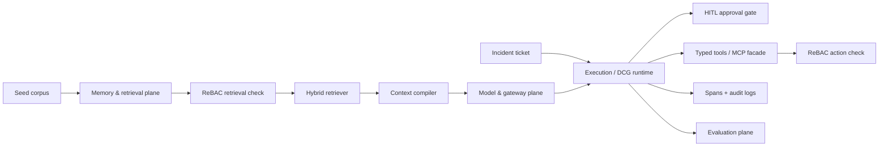

# Architecture

## Six Planes

- **Memory & retrieval:** deterministic ingestion builds documents, chunks,
  provenance, and graph edges.
- **Context compiler:** emits typed execution packets with stable static
  prefixes and dynamic cited evidence.
- **Execution / DCG runtime:** runs bounded nodes: `plan`, `retrieve`,
  `reason`, `act`, `review`, `repair`, `finalize`.
- **Model & gateway:** provider-agnostic interface with local deterministic
  provider, budget checks, and stable-prefix accounting.
- **Governance & security:** local OpenFGA-style ReBAC checks run in retrieval
  and action paths.
- **Observability & evaluation:** JSONL spans, Cloudflare-style audit logs, and
  golden eval scores.

## DCG Node Taxonomy

| Node | Inputs | Outputs | Budget | Retry | Provenance |
|---|---|---|---|---|---|
| plan | ticket, actor | plan intent | 0.05 USD | 1 | run ID |
| retrieve | ticket, authz | cited chunks | 0.05 USD | 1 | chunk provenance |
| reason | execution packet | model answer | 0.10 USD | 1 | citation IDs |
| act | tool calls, approval | tool result or interrupt | 0.05 USD | 0 | tool scope |
| review | answer, policy | review status | 0.02 USD | 1 | cited answer |
| repair | failed node | repaired state | 0.02 USD | 1 | failure record |
| finalize | state | answer file | 0.01 USD | 0 | output path |

## Trust Boundaries

- Corpus and ticket text are untrusted input.
- Retrieval cannot return unauthorized chunks.
- Action tools independently check ReBAC and approval.
- Non-allowlisted MCP servers are blocked.
- High-risk writes interrupt by default.
- The default model provider is deterministic and local; live providers are
  optional adapters.

